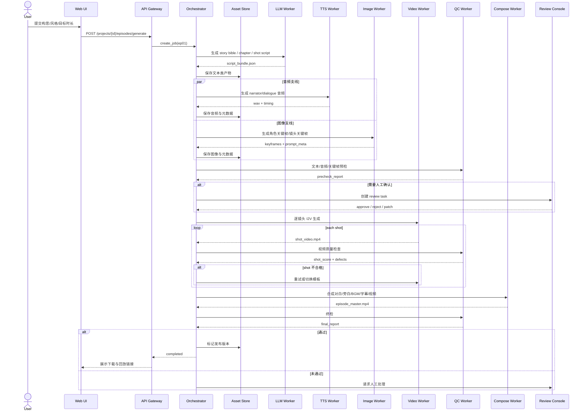
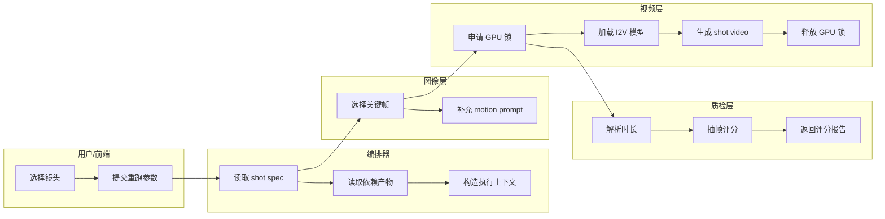
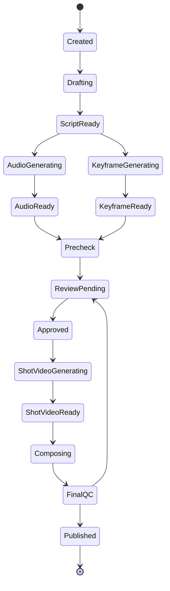

# 25 端到端时序图与泳道图

## 1. 文档目标

本文件定义“用户输入小说构思，到输出可播放章节视频”的端到端时序，明确：

- 谁发起任务
- 谁决定阶段流转
- 哪些阶段占用 GPU
- 哪些阶段可以并行
- 哪些阶段必须等人工确认
- 失败后回到哪里重跑

---

## 2. 主要参与者

- `web-ui`：前端任务中心
- `api-gateway`：统一入口
- `orchestrator`：状态机与编排器
- `asset-store`：文件与产物索引
- `llm-worker`：小说/脚本/提示词重写
- `tts-worker`：旁白/对白音频生成
- `image-worker`：关键帧生成
- `video-worker`：I2V 视频生成
- `qc-worker`：ASR、时长校验、质量评分
- `compose-worker`：字幕、混音、mux、导出
- `review-console`：人工审核页面

---

## 3. 章节生产总时序

---

## 4. 泳道图：单镜头生产

---

## 5. 并行与串行规则

### 5.1 串行阶段

以下阶段必须通过 GPU 串行执行：

- LLM 长文本生成（当使用 GPU 推理）
- TTS 推理（若启用 GPU）
- 关键帧扩散生成
- I2V 视频生成
- ASR 若采用 GPU 大模型

### 5.2 可并行阶段

以下阶段允许 CPU 并行：

- shot script 切分
- prompt 结构化与模板展开
- 目录创建与元数据写入
- FFmpeg 素材准备
- 日志写入与评分聚合
- review 任务创建

### 5.3 批处理建议

- 同一章节的 `dialogue` 音频可以按角色分组批量生成
- 同一场景的关键帧可以按 `scene_id` 成组生成
- 视频必须按 `shot_id` 逐个执行，不建议多镜头并行争抢 GPU

---

## 6. 人工介入点

建议只保留三个明确的人工审核点：

1. **脚本审核点**：确认剧情方向、节奏和台词
2. **关键帧审核点**：确认角色脸和场景风格
3. **终片审核点**：确认是否导出正式版本

除此之外，默认走自动流水线，不在中间增加过多人工 stop。

---

## 7. 失败回退路径

| 失败阶段 | 回退起点 | 是否需要重跑前序 | 说明 |
|---|---|---|---|
| story bible 失败 | concept_input | 否 | 仅重试 LLM |
| shot script 不满意 | chapter_text | 否 | 可重新适配为脚本 |
| TTS 读错 | 单句 audio segment | 否 | 定位片段重生 |
| 关键帧风格漂移 | 单镜头 keyframe | 否 | 替换参考图后重生 |
| I2V 闪烁/畸变 | 单镜头 shot_video | 否 | 切模板或重写 motion prompt |
| 合成失败 | compose task | 否 | 重新跑 ffmpeg |
| 终检不过 | 失败镜头集合 | 否 | 只回滚问题镜头 |

---

## 8. 章节级状态主图

---

## 9. 实现要求

- 所有阶段必须输出统一 `stage_result.json`
- 每次状态变化必须写入 `job_events`
- 任何人工修改都要产生新版本，不覆盖旧版本
- `shot_id` 是最小重跑粒度，不能直接只重跑“半个镜头”
- 所有 worker 都必须支持 `dry_run=true` 模式，用于联调
