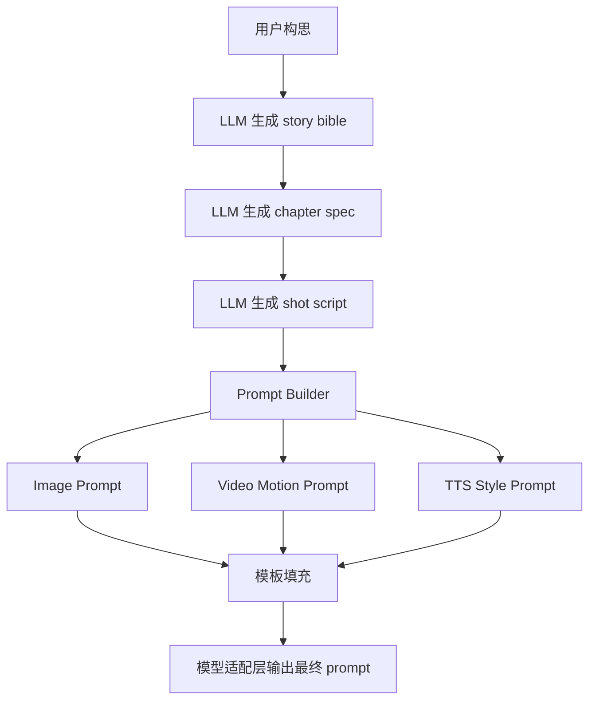

# 26 提示词工程与中间结构规范

## 1. 原则

系统不允许把用户原始构思直接透传给图像或视频模型。必须经过三层中间结构：

1. **叙事结构层**：剧情、人物、事件、冲突
2. **制作脚本层**：场景、镜头、对白、旁白、时长
3. **模型提示层**：面向具体模型的 prompt 与参数

这样做的目标是解耦创作意图和模型实现，便于：

- 替换模型
- 追踪错误来源
- 局部重跑
- 人工编辑
- 复用同一章节到不同风格

---

## 2. 中间结构定义

### 2.1 Story Bible

用于约束小说生成：

- 世界观边界
- 角色基础设定
- 禁止事项
- 语言风格规则
- 节奏目标

### 2.2 Chapter Spec

用于约束章节级创作：

- 本章主题
- 主要冲突
- 场景列表
- 关键转折
- 章节结尾钩子

### 2.3 Shot Script

用于约束制作：

- scene_id
- shot_id
- shot_type
- speaker
- narration_text
- dialogue_text
- visual_focus
- motion_hint
- duration_hint_sec
- audio_priority
- review_required

### 2.4 Model Prompt Spec

面向具体模型：

- `image_prompt_positive`
- `image_prompt_negative`
- `video_motion_prompt`
- `tts_style_tags`
- `rewriter_policy`
- `generation_params`

---

## 3. Prompt 生成流水线



---

## 4. Prompt Builder 的职责

Prompt Builder 不是“再让 LLM 自由发挥一次”，而是一个受约束的构造器：

- 输入固定 JSON
- 按模板组合字段
- 对风格词做白名单筛选
- 对违禁词做清洗
- 补充模型必须参数
- 生成调试可见的结构化 prompt

输出必须包含：

```json
{
  "prompt_version": "pv_0012",
  "source_shot_id": "ep01_sc02_sh05",
  "positive_prompt": "...",
  "negative_prompt": "...",
  "style_tags": ["cinematic", "rainy", "close-up"],
  "sampling_profile": "image.default.v1",
  "debug_tokens": {
    "character_anchor": ["scar under left eye", "dark red inner robe"],
    "scene_anchor": ["dim tavern", "warm candlelight"],
    "motion_anchor": ["slow push-in"]
  }
}
```

---

## 5. 各模型的 prompt 规范

### 5.1 LLM 写作 prompt

目标：稳定输出 JSON 或 markdown，而不是追求华丽。

约束：
- 明确输出 schema
- 明确不可新增角色和世界观硬设定
- 明确禁止跳过场景号
- 明确每个 shot 的时长范围

示例模板：

```text
你是章节改编器，不是小说续写器。
请把输入章节改写成分镜脚本 JSON。
要求：
1. 每个 shot 时长 2 到 6 秒。
2. 对白与旁白分开。
3. 每个 shot 必须有 visual_focus、emotion、motion_hint。
4. 不得新增未在角色表中出现的新角色。
5. 输出只允许 JSON，不要附加说明。
```

### 5.2 TTS prompt

只允许风格标签和文本内容，不允许掺入镜头信息。

```json
{
  "speaker": "女剑客",
  "text": "我不记得自己是谁。",
  "style_tags": ["low", "restrained", "cold"],
  "speed": 0.97,
  "pause_ms_after": 180
}
```

### 5.3 Image prompt

拆为四段：
- 角色锚点
- 场景锚点
- 构图描述
- 风格描述

模板：

```text
[角色锚点], [场景锚点], [shot framing], [lighting], [style], highly detailed, cinematic frame
```

### 5.4 Video motion prompt

只描述“如何动”，不要重复静态画面太多次。

模板：

```text
slow push-in, subtle head turn, candlelight flicker, dust floating, restrained emotion, realistic motion, no abrupt movement
```

---

## 6. 负面提示词策略

建议建立统一的 negative prompt profile：

- extra fingers
- distorted anatomy
- deformed face
- blurry eyes
- duplicate person
- warped hands
- flicker
- overexposed
- oversaturated
- low detail background

视频模型的 negative 词必须和图像模型区分存放，不能混用同一套 profile。

---

## 7. Prompt 版本策略

所有 prompt 都要版本化：

- `prompt_template_version`
- `prompt_builder_version`
- `style_pack_version`
- `rewriter_version`

一旦产物质量变差，可以快速回溯到 prompt 层的变化。

---

## 8. 人工编辑原则

允许人工编辑的只有三层：

1. story bible
2. shot script
3. model prompt spec

不允许人工直接修改最终模型内部隐藏 prompt 片段，否则不可追踪。
