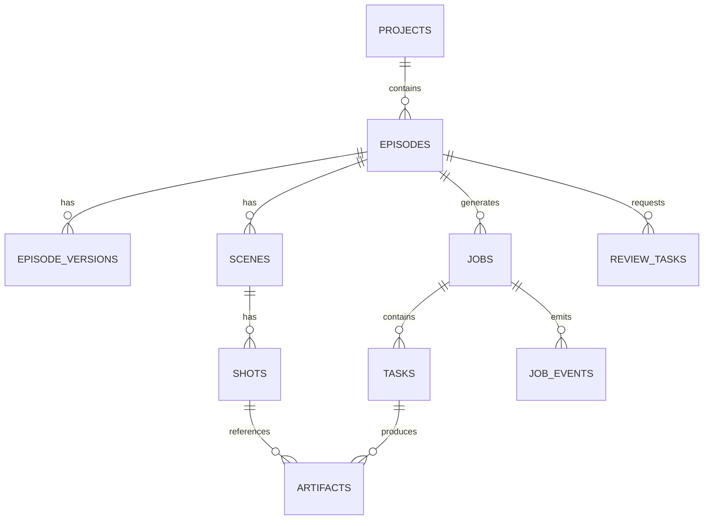

# 28 数据库设计与迁移策略

## 1. 技术选型

v1 推荐：

- 关系型数据库：PostgreSQL
- ORM：SQLAlchemy 2.x
- 迁移：Alembic
- JSON 扩展字段：JSONB
- 软删除：布尔字段 + deleted_at

原因：
- 需要事务
- 需要复杂过滤和版本追踪
- 需要审计事件
- 需要对 JSON metadata 做条件检索

---

## 2. 核心表

### 2.1 projects

| 字段 | 类型 | 说明 |
|---|---|---|
| id | varchar pk | 项目 ID |
| name | varchar | 项目名 |
| language | varchar | 主语言 |
| target_style | varchar | 风格 |
| config_json | jsonb | 运行配置 |
| created_at | timestamptz | 创建时间 |
| updated_at | timestamptz | 更新时间 |

### 2.2 episodes

| 字段 | 类型 | 说明 |
|---|---|---|
| id | varchar pk | 章节 ID |
| project_id | varchar fk | 所属项目 |
| index_no | int | 章节序号 |
| title | varchar | 章节标题 |
| status | varchar | 当前状态 |
| current_version | int | 当前版本号 |
| runtime_target_sec | int | 目标时长 |

### 2.3 episode_versions

保存每次章节重写与重编排的版本快照。

### 2.4 scenes

记录 scene 级分组。

### 2.5 shots

记录 shot 基本信息和当前产物引用。

### 2.6 artifacts

统一管理一切产物：
- markdown
- json
- wav
- png
- mp4
- ass
- review report

字段建议：

| 字段 | 类型 | 说明 |
|---|---|---|
| id | varchar pk | artifact id |
| project_id | varchar | 项目 |
| episode_id | varchar | 章节 |
| shot_id | varchar nullable | 镜头 |
| kind | varchar | audio/keyframe/video/script/report |
| path | varchar | 文件相对路径 |
| checksum | varchar | 文件摘要 |
| version | int | 版本 |
| meta_json | jsonb | 模型参数、prompt 等 |
| created_by_task_id | varchar | 来源任务 |

### 2.7 jobs

章节级作业。

### 2.8 tasks

阶段级任务。

### 2.9 job_events

事件溯源表，记录所有状态切换。

### 2.10 review_tasks

人工审核任务。

---

## 3. 表关系建议

---

## 4. 迁移策略

### 4.1 原则

- 每次 schema 变更必须写 Alembic migration
- 禁止在生产数据库手工改表
- JSONB 字段用于扩展，不替代正式结构
- 大字段如原始 prompt 和原始日志落文件，库里只存索引

### 4.2 推荐顺序

1. 建 `projects/episodes/jobs/tasks`
2. 建 `artifacts/job_events`
3. 建 `shots/scenes/review_tasks`
4. 增加索引与唯一约束

### 4.3 必备索引

- `artifacts(project_id, episode_id, kind, version desc)`
- `tasks(job_id, stage, status)`
- `job_events(job_id, created_at)`
- `shots(episode_id, scene_id, shot_index)`

---

## 5. 幂等与唯一约束

建议约束：

- 同一 `job_id + stage + target_ref` 只能有一个进行中的任务
- 同一 artifact 的 `checksum + kind + episode_id` 可做去重索引
- review task 的 `target_artifact_id + review_type + status=open` 只能有一个

---

## 6. 数据保留策略

- 当前发布版本永久保留
- 中间失败产物保留 14 天
- 临时缓存保留 3 天
- worker 原始 stdout/stderr 压缩归档

---

## 7. 恢复策略

系统重启后：

1. 读取 `tasks` 中 `running` 状态任务
2. 对比 `worker_heartbeat` 和文件落盘情况
3. 标记为 `unknown` 或 `retryable`
4. 由 orchestrator 决定是否补偿或重跑
