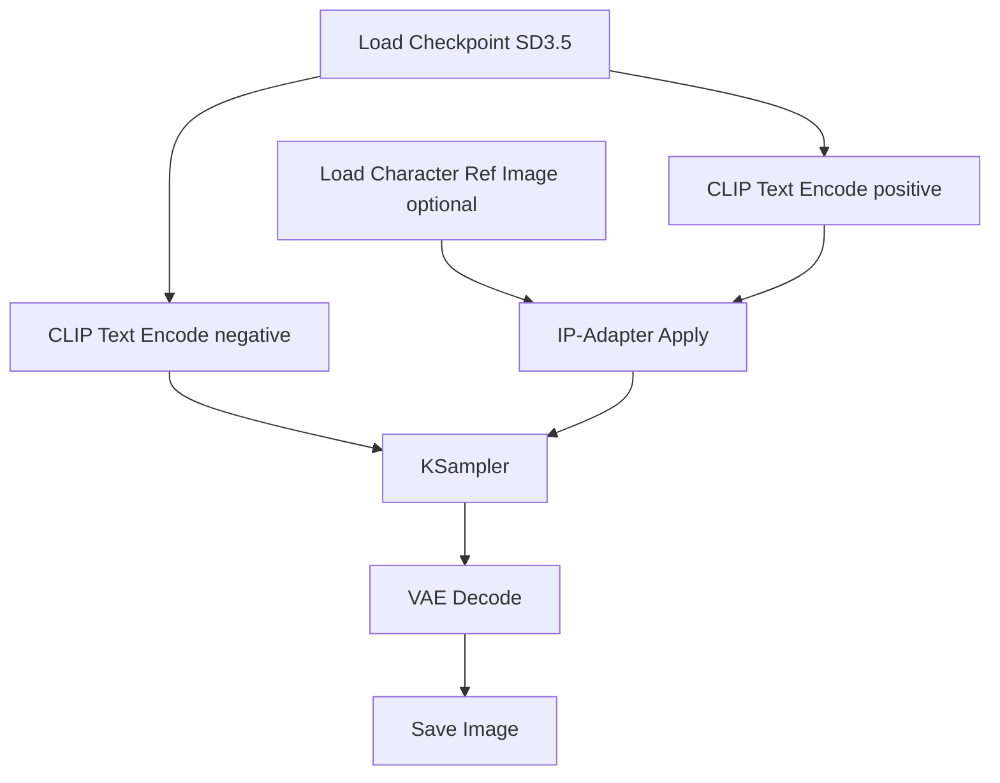

# 31 ComfyUI Workflow 节点设计

## 1. 目标

本文件定义关键帧阶段在 ComfyUI 中的推荐节点图，便于：

- 统一生成风格
- 暴露必要参数
- 让 orchestrator 能通过 API 注入变量
- 支持 reference image、IP-Adapter、ControlNet

---

## 2. 关键帧工作流拆分

建议拆成三个独立 workflow：

1. `wf_character_sheet.json`
2. `wf_scene_keyframe.json`
3. `wf_regen_with_patch.json`

---

## 3. 角色立绘工作流



参数建议：
- batch size: 4
- output count: 4 张候选
- same seed family: 是
- negative prompt 使用统一 profile

---

## 4. 剧情关键帧工作流

推荐节点：

- Checkpoint Loader
- Positive / Negative Text Encode
- IP-Adapter Loader
- Load Image（角色参考）
- Load Image（场景参考，可选）
- ControlNet Loader（pose/depth/edge，按需）
- KSampler
- VAE Decode
- Save Image
- Save Metadata

说明：
- `Save Metadata` 必须保存 seed、cfg、steps、prompt 版本
- 角色参考图和场景参考图分两个输入口，不要混为单一 image ref

---

## 5. Patch 重生成工作流

用于人工审核后修补：

输入：
- 原关键帧
- patch directive
- optional mask

patch directive 示例：
- “脸部更冷峻”
- “衣服改为暗红内衬”
- “镜头更近”
- “背景再暗一点”

实现方式：
- img2img
- 局部 mask inpaint
- 保持固定角色参考

---

## 6. orchestrator 与 ComfyUI 对接

推荐由 orchestrator 维护一个 workflow 模板仓：

```text
workflows/comfyui/
  wf_character_sheet.json
  wf_scene_keyframe.json
  wf_regen_with_patch.json
  variables_schema.json
```

编排器填充变量：

```json
{
  "positive_prompt": "...",
  "negative_prompt": "...",
  "seed": 123456,
  "steps": 28,
  "cfg": 6.5,
  "ref_character_image": ".../swordswoman/front.png",
  "ref_scene_image": ".../tavern_night_v1.png",
  "output_path": "assets/keyframes/ep01_sc02_sh05_v1.png"
}
```

---

## 7. 文件命名规范

- `characters/{character_id}/sheet_v001.png`
- `backgrounds/{scene_id}/bg_v001.png`
- `keyframes/{shot_id}/kf_v001.png`
- `keyframes/{shot_id}/kf_v001.meta.json`

---

## 8. review 建议

生成关键帧后，review console 应展示：

- 原 shot 文本
- 使用的角色参考图
- 使用的场景参考图
- 本次 positive/negative prompt
- 4 张候选图
- 一键设为 approved / regen / patch

---

## 9. 最佳实践

- 不要让模型一次输出太多剧情差异候选，应该只做构图细微差异
- 同一角色的立绘先固定，再进剧情镜头
- 强制保存 prompt metadata，否则后续不可复现
