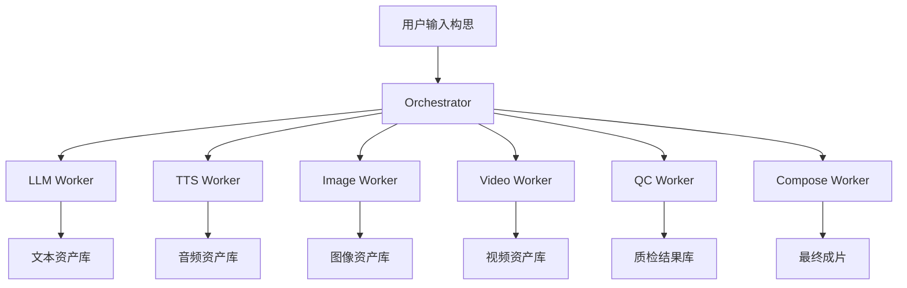
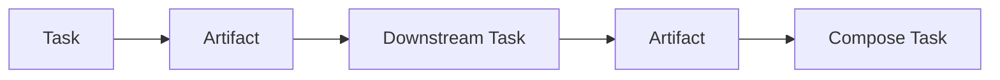
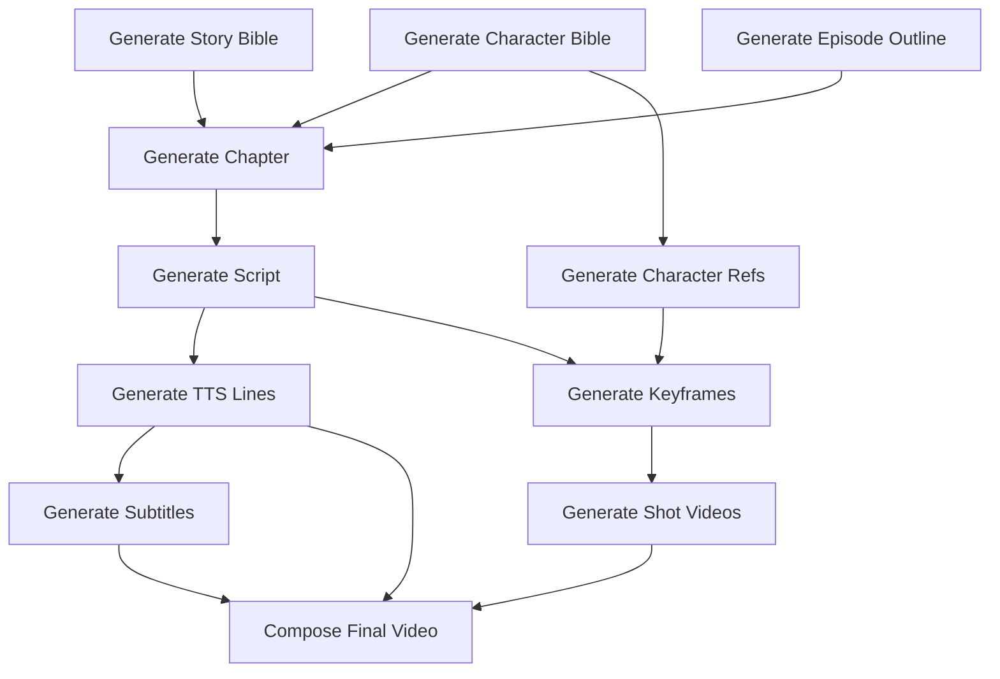

# 03 系统架构设计

## 3.1 架构概览

系统采用**分层 + 任务编排 + 文件资产驱动**的架构。

核心原则：
- 控制面与执行面分离
- 任务状态与媒体资产分离
- 大模型通过 worker 隔离
- 文件系统是事实来源之一
- 元数据数据库记录索引和依赖

---

## 3.2 分层设计

### 1）接口层
负责：
- 接收用户输入
- 暴露项目管理 API
- 查询任务状态
- 触发重跑

建议技术：
- FastAPI

### 2）编排层
负责：
- 任务拆分
- 状态流转
- 依赖关系管理
- GPU 互斥调度
- 重试与恢复

建议技术：
- FastAPI + 本地任务队列 + SQLite/PostgreSQL

### 3）执行层
包括多个 worker：
- LLM Worker
- TTS Worker
- Image Worker
- Video Worker
- QC Worker
- Compose Worker

### 4）资产层
负责持久化：
- JSON 中间件
- 音频文件
- 图片文件
- 视频文件
- 日志与元数据

### 5）观测层
负责：
- 日志
- 指标
- 失败追踪
- 执行报告

---

## 3.3 模块边界

## 3.3.1 Orchestrator
职责：
- 创建项目
- 解析 workflow
- 创建 task DAG
- 记录状态
- 调用 worker
- 做重试和恢复
- 维护 artifact 依赖

输入：
- 用户请求
- 上游产物 metadata
- 配置模板

输出：
- task records
- artifact records
- 调度指令

不负责：
- 模型推理细节
- 媒体后处理细节

## 3.3.2 LLM Worker
职责：
- 根据 prompt 模板生成结构化文本
- 生成故事圣经、正文、分镜脚本
- 做 prompt rewrite

输入：
- prompt template
- 上下文窗口拼接结果
- 输出 schema

输出：
- 结构化文本资产

不负责：
- 持久化策略
- 后续多媒体阶段

## 3.3.3 TTS Worker
职责：
- 根据 speaker 和情绪标签合成语音
- 输出单句音频
- 生成 speaker-level metadata

输入：
- line text
- speaker profile
- ref audio
- style tags

输出：
- wav 文件
- duration metadata

## 3.3.4 Image Worker
职责：
- 生成角色设定图
- 生成场景设定图
- 生成关键帧
- 根据参考图保持一致性

输入：
- prompt
- negative prompt
- character refs
- control signals

输出：
- png/jpg
- 推理参数 metadata

## 3.3.5 Video Worker
职责：
- 将关键帧转为镜头视频
- 记录 motion prompt 和参数
- 输出 shot 级视频

输入：
- keyframe
- motion prompt
- target duration
- model preset

输出：
- mp4
- 帧数和时长 metadata

## 3.3.6 QC Worker
职责：
- 对语音回查
- 对成片进行基础校验
- 生成问题清单

输入：
- audio/video artifacts
- expected text

输出：
- qc reports
- mismatch list

## 3.3.7 Compose Worker
职责：
- 拼接音频、视频
- 生成字幕
- 导出预览版和正式版

输入：
- shot list
- audio list
- subtitle list
- transition settings

输出：
- final mp4
- ass/srt 字幕
- render report

---

## 3.4 存储设计

建议同时使用两类存储：

### 文件系统
保存二进制大文件：
- wav
- png
- mp4
- ass

### 元数据数据库
保存索引与依赖：
- projects
- tasks
- artifacts
- task_runs
- qc_reports

推荐：
- v1：SQLite
- v2：PostgreSQL

---

## 3.5 任务与资产的关系

一个任务可以产生多个资产。  
一个资产可以被多个下游任务复用。  
例如：
- 同一个角色立绘可用于多个关键帧任务
- 同一句对白可同时用于字幕和时间轴

---

## 3.6 DAG 设计

项目应被拆成一张 DAG，而不是线性黑盒流程。

示例：

---

## 3.7 关键设计决策

### 决策 1：以 shot 为最小重跑单元
这样可以局部纠错，成本最低。

### 决策 2：大模型串行占 GPU
24GB 单卡下，这不是选择题，是约束条件。

### 决策 3：文本层和媒体层解耦
小说重写不应立即触发全部媒体重做，必须通过依赖分析决定影响范围。

### 决策 4：所有 worker 都是无状态的
状态保存在数据库和文件系统中，worker 崩溃后可直接重启。

### 决策 5：中间产物永不隐式覆盖
任何重生成都应产出新版本，再由 orchestrator 决定是否切换 active 版本。

---

## 3.8 配置管理

建议把配置分成四层：

1. **global config**
   - 路径
   - 默认模型
   - GPU 策略

2. **project config**
   - 风格偏好
   - 语言
   - 分辨率
   - 章节长度

3. **workflow preset**
   - 某类故事的默认模板
   - 某类视频风格的默认参数

4. **task override**
   - 某个具体镜头的特殊设置

---

## 3.9 推荐技术栈

- Python 3.11+
- FastAPI
- Pydantic
- SQLAlchemy
- SQLite / PostgreSQL
- Redis（可选，非必须）
- ComfyUI
- FFmpeg
- vLLM
- Typer / Click（CLI）
- Pytest

---

## 3.10 v1 架构取舍

为了降低复杂度，v1 建议：
- 不上消息中间件
- 不上 Kubernetes
- 不做复杂前端
- 不做多用户并发隔离
- 不做分布式对象存储

先把单机、单项目、多任务串行跑通。
