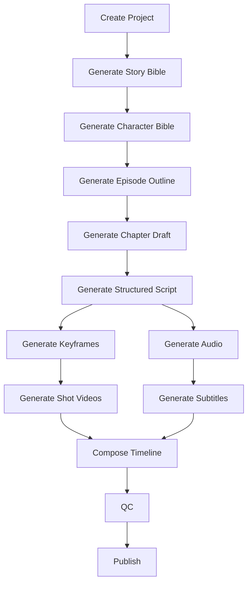
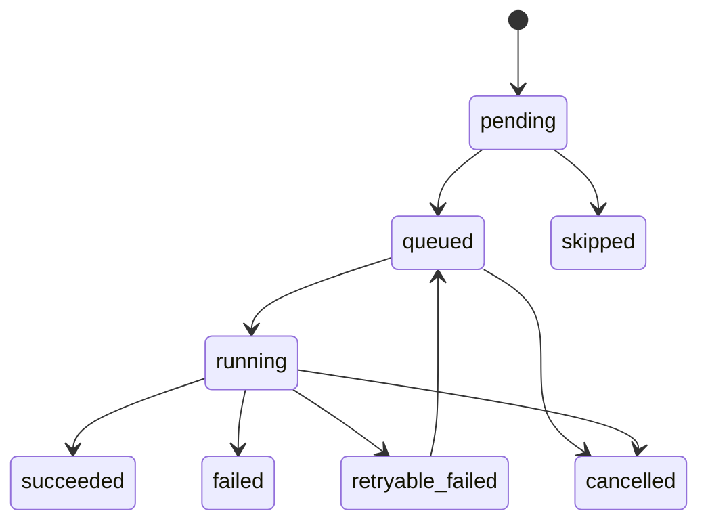

# 04 核心 Workflow 与状态机

## 4.1 Workflow 总览

核心 workflow 分为 8 个阶段：

1. 项目初始化
2. 文本资产生成
3. 分镜脚本生成
4. 语音生成
5. 关键帧生成
6. 镜头视频生成
7. 合成与字幕
8. QA 与发布

每个阶段都输出明确 artifact，并在数据库中登记状态。

---

## 4.2 顶层 workflow

---

## 4.3 状态机设计

## 4.3.1 Task 状态

每个 task 建议具备以下状态：

- `pending`
- `queued`
- `running`
- `succeeded`
- `failed`
- `retryable_failed`
- `skipped`
- `cancelled`

状态转换图：

## 4.3.2 Artifact 状态

每个 artifact 建议具备：

- `draft`
- `active`
- `deprecated`
- `invalid`

解释：
- `draft`：刚生成，未被上游确认
- `active`：当前被系统使用的版本
- `deprecated`：旧版本，保留但不参与后续默认流程
- `invalid`：校验失败，不应被消费

---

## 4.4 阶段 1：项目初始化

### 输入
- 项目名
- 故事构思
- 风格要求
- 视频风格
- 语言
- 目标输出配置

### 输出
- `project.json`
- 项目目录
- 初始任务图

### 步骤
1. 创建 project_id
2. 初始化目录结构
3. 落盘用户输入
4. 生成默认 config
5. 写入数据库

---

## 4.5 阶段 2：文本资产生成

### 任务顺序
1. Generate Story Bible
2. Generate Character Bible
3. Generate Episode Outline
4. Generate Chapter Draft

### 建议策略
- `story_bible` 和 `character_bible` 可并行生成
- `chapter_draft` 依赖前三者
- 每步输出前做 schema 校验

### 失败处理
- 若 JSON schema 校验失败，先让 LLM 自修复一轮
- 再失败则标记 `retryable_failed`

---

## 4.6 阶段 3：分镜脚本生成

将章节正文转换为 scene/shot 结构。

### 输入
- chapter draft
- character bible
- style preset
- shot duration rules

### 输出
- `ep01_script.jsonl`

### 每条 shot 至少包含
- `scene_id`
- `shot_id`
- `speaker`
- `narration_text`
- `dialogue_text`
- `emotion`
- `visual_prompt`
- `motion_prompt`
- `duration_hint_sec`
- `character_refs`
- `location_tag`

### 规则
- 单条 `dialogue_text` 建议不超过 20 秒朗读长度
- 单个 shot 建议 2–6 秒
- 长对白必须拆镜头或拆句

---

## 4.7 阶段 4：语音生成 workflow

### 子任务
1. normalize text
2. assign speaker
3. select voice profile
4. synthesize line
5. post-process audio
6. qc with asr

### 产物
- 原始音频
- 归一化音频
- duration metadata
- ASR 对照报告

### 失败策略
- 某句失败只重跑该句
- 若 ASR 相似度低于阈值，进入重跑队列
- 发音问题允许人工 override

---

## 4.8 阶段 5：关键帧生成 workflow

### 子任务
1. prepare reference pack
2. build prompt
3. generate draft keyframe
4. validate composition
5. optional upscale
6. activate artifact

### 核心输入
- 角色参考图
- 场景设定图
- shot 的 visual prompt
- pose/depth/lineart control（可选）

### 核心规则
- 同角色在同一章节内优先复用同一 reference pack
- 不满意时，不直接覆盖旧图，而是创建 v2/v3 版本

---

## 4.9 阶段 6：镜头视频生成 workflow

### 子任务
1. read active keyframe
2. rewrite motion prompt
3. run i2v generation
4. validate duration and format
5. optional interpolate / extend
6. activate shot video

### 建议参数
- v1：480p
- 帧数：约 121
- fps：24
- 单 shot：3–5 秒为主

### 失败策略
- `OOM`：自动降级 preset
- `motion collapse`：切换更保守 motion prompt
- `artifact mismatch`：回退到上一版 keyframe

---

## 4.10 阶段 7：合成与字幕

### 子任务
1. 时间轴对齐
2. 拼接镜头
3. 对齐对白
4. 生成字幕
5. 混合 BGM/环境音（可选）
6. 导出 preview
7. 导出 final

### 规则
- 时间轴以音频时长为准
- 视频可裁切、轻微变速或尾帧冻结
- 不建议强行拉伸音频

---

## 4.11 阶段 8：QA 与发布

### QA 内容
- 音频文本一致性
- 视频文件完整性
- 字幕时间轴有效性
- 角色一致性抽样
- 项目资源完整性

### 发布产物
- `final.mp4`
- `subtitles.ass`
- `render_report.json`
- `release_note.md`

---

## 4.12 局部重跑 workflow

系统必须支持下面四种局部重跑：

### 类型 A：重跑单句 TTS
影响范围：
- 某句音频
- 字幕时间轴
- 最终合成

### 类型 B：重跑单镜头关键帧
影响范围：
- keyframe
- shot video
- 最终合成

### 类型 C：重跑单镜头视频
影响范围：
- shot video
- 最终合成

### 类型 D：重写一段脚本
影响范围：
- script lines
- 对应 TTS
- 对应 keyframes
- 对应 shot videos
- 最终合成

---

## 4.13 幂等性要求

每个任务在同一输入签名下必须能被判定是否已完成。

推荐使用：
- `input_hash`
- `config_hash`
- `model_version`
- `prompt_template_version`

组合形成缓存键。

如果缓存命中且产物有效，则任务可直接标记 `succeeded_from_cache`（可作为扩展状态）。

---

## 4.14 断点恢复

系统中断后恢复流程：

1. 读取 project 状态
2. 扫描未完成 task
3. 校验 active artifact 是否存在
4. 对 `running` 状态任务执行修复：
   - 若无输出，回滚到 `queued`
   - 若有部分输出，转 `retryable_failed`
5. 从安全点重新入队

---

## 4.15 人工介入点

建议允许人工插入以下修正点：
- 编辑 story bible
- 编辑 character bible
- 修改 shot script
- 替换 voice ref
- 替换角色参考图
- 指定某镜头的 prompt override
