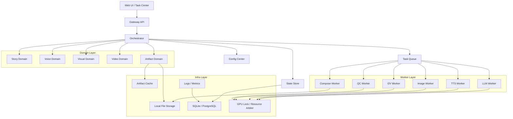

# 10_分层架构与模块职责详细设计

## 1. 设计目标

本系统不是单一模型调用脚本，而是一个“多阶段内容生产平台”。因此架构设计必须满足：

- 支持多模型串联
- 支持中间产物持久化
- 支持失败重跑和人工介入
- 支持不同 workflow 模板
- 支持后续替换任一模型而不推倒整体系统

在 24GB 单卡约束下，架构必须优先考虑 **GPU 资源互斥、阶段解耦、产物复用**。

---

## 2. 分层架构

---

## 3. 分层职责

### 3.1 UI 层
负责：
- 创建项目
- 上传构思、参考图、参考音色
- 查看任务树
- 查看每个阶段的输入输出
- 重跑失败节点
- 手工替换关键帧或语音
- 导出最终视频

不负责：
- 直接处理模型调用
- 保存复杂业务状态
- 决定编排策略

### 3.2 API 层
负责：
- 提供稳定 REST API
- 做输入校验
- 做权限和会话管理
- 做请求幂等
- 将命令转为编排器事件

不负责：
- 长流程状态机
- GPU 调度
- 文件生成逻辑

### 3.3 Orchestrator 层
是系统核心，负责：
- 解析 workflow
- 驱动状态机
- 切分阶段任务
- 生成子任务 DAG
- 处理重试、回滚、补偿
- 记录产物依赖关系
- 决定局部重跑范围

### 3.4 Domain 层
负责定义核心业务对象及规则：
- 项目、章节、场景、镜头
- 声音角色、视觉角色
- Artifact、版本、缓存键
- 任务与阶段间依赖

### 3.5 Worker 层
负责执行具体模型或处理任务：
- LLM worker：文本生成、重写、摘要、脚本化
- TTS worker：语音生成、切句、音量标准化
- Image worker：角色图、背景图、镜头关键帧
- I2V worker：关键帧驱动短视频镜头
- QC worker：ASR 校验、时长和内容一致性检查
- Compose worker：FFmpeg 合成、字幕烧录、封装输出

### 3.6 Infra 层
负责底层能力：
- 文件存储
- 数据库存储
- 日志与指标
- 缓存
- GPU 互斥控制

---

## 4. 模块边界原则

### 4.1 文本与视觉必须通过中间结构交互
不能让“小说正文”直接给图像和视频模型。必须通过结构化脚本：
- 场景
- 镜头
- 动作
- 情绪
- 摄影语言
- 时长提示
- 参考资产

### 4.2 Artifact 是一等公民
每个阶段都必须输出可持久化的 Artifact：
- 原始输入
- 结构化中间件
- 原始模型输出
- 后处理输出
- 评分与日志
- 元信息

### 4.3 Worker 必须尽量无状态
Worker 不保存项目长状态，只接收任务并产出结果。这样便于：
- 替换模型
- 重试
- 迁移部署方式
- 单步调试

### 4.4 Orchestrator 是唯一状态真源
任何“当前阶段是否完成、是否可重跑、依赖哪些产物”等信息，都由 Orchestrator 统一维护。

---

## 5. 模块职责矩阵

| 模块 | 输入 | 输出 | 状态持有 | 可重跑粒度 |
|---|---|---|---|---|
| API | 用户请求 | 命令事件 | 否 | 无 |
| Orchestrator | 命令事件、任务结果 | 子任务、状态更新 | 是 | 项目/章/场景/镜头 |
| LLM Worker | 文本任务 | bible、outline、script、prompts | 否 | 节点级 |
| TTS Worker | 句子、voice profile | wav、timing、segments | 否 | 句子级 |
| Image Worker | shot spec、角色参考 | 关键帧图像 | 否 | 镜头级 |
| I2V Worker | 关键帧、motion prompt | shot 视频 | 否 | 镜头级 |
| QC Worker | 文本、音频、视频 | QC 报告 | 否 | 句子/镜头/片段级 |
| Compose Worker | 片段音视频、字幕 | 最终成片 | 否 | 章节级/段落级 |

---

## 6. 典型调用路径

### 6.1 创建项目
1. UI 提交构思和风格
2. API 校验后发出 `ProjectCreated`
3. Orchestrator 初始化项目树
4. 生成 `GenerateStoryBibleTask`

### 6.2 生成第一章成片
1. 小说正文生成
2. 分镜脚本生成
3. 句子分片 + 配音
4. 关键帧生成
5. 镜头视频生成
6. 合成 + QC
7. 产出导出资源

---

## 7. 为什么不做“全自动黑盒管线”

因为这类创意系统必须支持：
- 某一个镜头只重跑图像
- 某一句台词只重跑 TTS
- 某一个角色手工换参考图
- 某一章沿用旧版人物设定但重写剧情

如果没有清晰模块边界，后期几乎无法维护。

---

## 8. 推荐实现约束

- 所有 Worker 统一使用任务输入 JSON 文件 + 输出 JSON 文件
- 所有产物都生成 `manifest.json`
- 所有阶段调用都带 `project_id`、`artifact_id`、`version_id`
- 所有 GPU 任务都必须先申请 `gpu_lock`
- 所有失败都要产出 machine-readable 错误码

---

## 9. 评审 checklist

- 模块边界是否清晰
- 是否存在跨层强耦合
- 中间产物是否可追溯
- 是否支持镜头级重跑
- Orchestrator 是否是唯一状态真源
- GPU 重任务是否串行
- 是否允许手工介入而不破坏状态一致性
