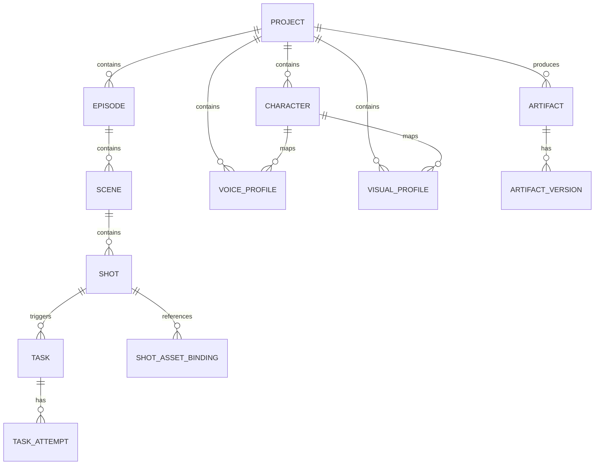
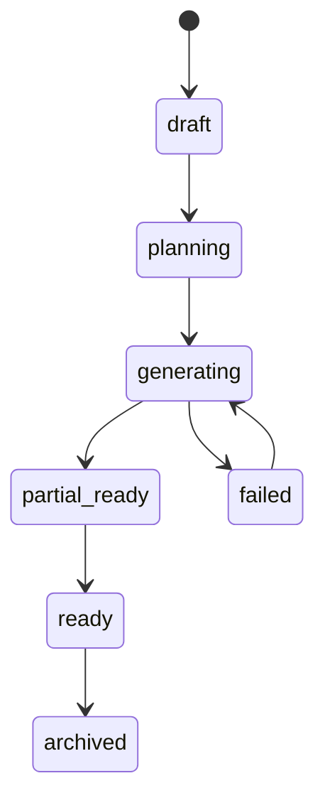
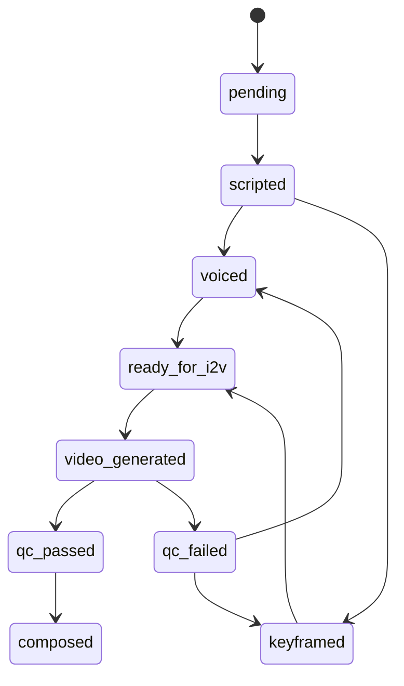

# 11_领域模型与实体生命周期

## 1. 领域建模目标

本系统不是简单的“任务列表”，而是一个围绕内容生成构建的领域模型。建模的重点是：

- 保留创作层级结构
- 支持版本化
- 支持局部重跑
- 支持跨阶段依赖追踪
- 支持素材复用

---

## 2. 核心实体总览

---

## 3. 实体定义

### 3.1 Project
表示一个完整创作项目。

字段建议：
- `project_id`
- `title`
- `status`
- `input_concept`
- `style_profile`
- `workflow_template_id`
- `created_at`
- `updated_at`

状态：
- draft
- planning
- generating
- partial_ready
- ready
- archived
- failed

### 3.2 Episode
表示章节或一集视频。

字段：
- `episode_id`
- `project_id`
- `index`
- `title`
- `outline_version_id`
- `novel_version_id`
- `script_version_id`
- `status`

### 3.3 Scene
表示叙事场景，一个章节可以有多个场景。

字段：
- `scene_id`
- `episode_id`
- `index`
- `summary`
- `emotion_curve`
- `location`
- `time_of_day`
- `status`

### 3.4 Shot
表示最小生产单元。

字段：
- `shot_id`
- `scene_id`
- `index`
- `shot_type`
- `duration_target_sec`
- `speaker_refs`
- `visual_intent`
- `motion_intent`
- `status`

shot 是整个系统的关键实体，因为：
- 关键帧按 shot 生成
- I2V 按 shot 生成
- 大部分局部重跑也是按 shot 进行

### 3.5 Character
统一抽象的角色定义。

字段：
- `character_id`
- `name`
- `role_type`
- `bio`
- `visual_anchor_words`
- `voice_style_words`
- `default_visual_profile_id`
- `default_voice_profile_id`

### 3.6 VoiceProfile
角色声音设定。

字段：
- `voice_profile_id`
- `character_id`
- `engine_name`
- `reference_audio_path`
- `emotion_tags`
- `speed`
- `pitch`
- `language`
- `version`

### 3.7 VisualProfile
角色视觉设定。

字段：
- `visual_profile_id`
- `character_id`
- `base_prompt`
- `negative_prompt`
- `reference_image_set`
- `costume_tags`
- `style_tags`
- `seed_policy`
- `version`

### 3.8 Artifact
表示任何阶段产物。

字段：
- `artifact_id`
- `project_id`
- `artifact_type`
- `scope_type`
- `scope_id`
- `current_version_id`
- `checksum`
- `storage_path`

artifact_type 示例：
- story_bible
- chapter_novel
- episode_outline
- shot_script
- tts_audio
- keyframe_image
- shot_video
- subtitle
- qc_report
- final_video

### 3.9 ArtifactVersion
版本化产物。

字段：
- `artifact_version_id`
- `artifact_id`
- `version_no`
- `source_task_id`
- `input_snapshot_hash`
- `metadata_json`
- `created_at`

### 3.10 Task / TaskAttempt
任务与任务尝试。

Task 字段：
- `task_id`
- `task_type`
- `scope_type`
- `scope_id`
- `status`
- `priority`
- `depends_on`
- `retry_policy`

TaskAttempt 字段：
- `attempt_id`
- `task_id`
- `worker_name`
- `start_time`
- `end_time`
- `exit_code`
- `stderr_path`
- `metrics_json`

---

## 4. 生命周期设计

### 4.1 Project 生命周期

### 4.2 Shot 生命周期

### 4.3 ArtifactVersion 生命周期

- created
- validated
- selected_as_current
- superseded
- archived

注意：新版本创建不等于立刻成为当前版本。必须经过校验。

---

## 5. 依赖关系建模

### 5.1 内容依赖
- `script` 依赖 `novel`
- `tts_audio` 依赖 `shot_script`
- `keyframe_image` 依赖 `shot_script + visual_profile`
- `shot_video` 依赖 `keyframe_image + motion_prompt`
- `final_video` 依赖 `shot_video + mixed_audio + subtitle`

### 5.2 重跑影响传播
示例：
- 改了 `voice_profile`，只影响相关句子音频和最终混音
- 改了 `visual_profile`，影响相关关键帧和下游视频
- 改了 `story_bible`，通常需要重新生成 outline、chapter、script

要通过依赖图自动推导“最小重跑集合”。

---

## 6. 建议数据库表

### 必备表
- `projects`
- `episodes`
- `scenes`
- `shots`
- `characters`
- `voice_profiles`
- `visual_profiles`
- `artifacts`
- `artifact_versions`
- `tasks`
- `task_attempts`
- `asset_bindings`
- `event_log`

### 重要索引
- `artifacts(project_id, artifact_type, scope_type, scope_id)`
- `tasks(status, priority, created_at)`
- `artifact_versions(artifact_id, version_no desc)`
- `shots(scene_id, index)`
- `events(project_id, created_at)`

---

## 7. 版本策略

### 7.1 不可变版本
任何产物版本一旦创建后不可修改。修改必须创建新版本。

### 7.2 当前版本指针
`artifacts.current_version_id` 指向当前选中版本。

### 7.3 软删除而不是物理删除
默认不删除历史版本，只在磁盘清理策略下做归档。

---

## 8. 面向实现的建模建议

- ORM 层使用显式 enum，不用自由字符串
- 时间统一保存 UTC
- 所有实体都带 `created_at / updated_at`
- 所有版本实体都保存 `input_snapshot_hash`
- 所有可执行任务都保存 `effective_config_json`

---

## 9. 评审 checklist

- 是否能表达项目、章节、场景、镜头层级
- 是否支持 voice / visual profile 独立演化
- Artifact 是否一等建模
- 是否支持不可变版本
- 是否能从变更自动推导重跑范围
- 是否区分 Task 和 TaskAttempt
