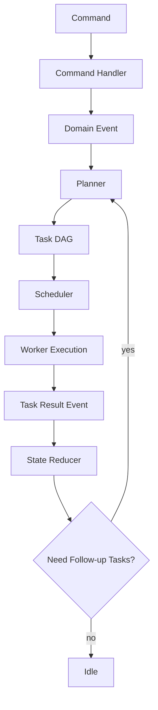

# 12_编排引擎与任务队列详细设计

## 1. 编排引擎的角色

编排引擎不是简单的 job queue，而是系统的大脑。它负责：

- 解析 workflow 模板
- 将项目目标切分成阶段任务
- 维护阶段状态机
- 控制依赖和并发
- 管理重试策略
- 管理回滚与补偿
- 保证 GPU 任务串行执行
- 决定哪些产物可复用

---

## 2. 为什么需要显式编排器

如果只是脚本串行调用模型，会遇到这些问题：

- 某一个镜头失败后无法局部继续
- 重新生成一个角色图时不知道哪些视频应失效
- 人工替换关键帧后无法回接下游流程
- 不能做任务暂停、恢复、取消
- 无法将“一个章节 30 个镜头”分解为可调度任务

所以必须把编排逻辑从 Worker 中剥离出来。

---

## 3. 编排模型：DAG + 状态机

### 3.1 两层编排
- **宏观状态机**：项目 / 章节 / 场景 / 镜头生命周期
- **微观任务 DAG**：具体任务依赖图

### 3.2 任务类型示例
- `generate_story_bible`
- `generate_episode_outline`
- `generate_chapter_novel`
- `generate_script`
- `prepare_tts_segments`
- `synthesize_tts_segment`
- `generate_keyframe`
- `generate_motion_prompt`
- `generate_shot_video`
- `run_qc_audio`
- `run_qc_video`
- `compose_episode`
- `burn_subtitle`

---

## 4. Orchestrator 组件拆分

### 4.1 Command Handler
把 API 命令转为领域事件：
- CreateProject
- StartEpisodeGeneration
- RetryShot
- ReplaceArtifact
- ApproveVersion
- CancelTask

### 4.2 Planner
根据 workflow 模板和当前状态生成任务 DAG。

### 4.3 Scheduler
负责把 ready 的任务推送到相应 worker 队列。

### 4.4 State Reducer
根据任务结果更新数据库状态。

### 4.5 Retry Manager
根据错误码和策略决定是否重试。

### 4.6 Compensation Manager
当上游版本切换时，失效或重新排队下游任务。

---

## 5. 状态流转



---

## 6. 任务状态

建议统一任务状态：

- created
- waiting_dependency
- ready
- queued
- running
- succeeded
- failed_retryable
- failed_terminal
- canceled
- superseded

说明：
- `superseded` 表示任务输出因新版本输入而失效，但不是运行失败
- `failed_retryable` 用于可自动重试的短暂错误
- `failed_terminal` 表示需要人工介入或修改输入后重跑

---

## 7. GPU 调度设计

### 7.1 核心约束
单张 24GB 卡无法让 Qwen、图像扩散、视频扩散长驻并发。必须：
- CPU 阶段并行
- GPU 阶段串行
- 允许小任务插队但不能破坏资源安全

### 7.2 GPU Lock
定义统一 GPU 资源锁，至少有以下状态：
- idle
- reserved
- running
- cool_down
- recovering

### 7.3 任务资源等级
- `gpu_heavy`: I2V、文生图大图
- `gpu_medium`: LLM、TTS、ASR
- `cpu_only`: FFmpeg 封装、manifest 生成、JSON 校验

调度策略：
1. 任何 `gpu_heavy` 任务独占执行
2. `gpu_medium` 任务在 `gpu_heavy` 空闲时执行
3. `cpu_only` 不受 GPU lock 限制

---

## 8. 重试策略

### 8.1 错误分类
- transient：网络、文件短暂锁、模型服务未就绪
- resource：OOM、磁盘空间不足
- input：提示词非法、缺失参考图、参数范围错误
- semantic：ASR 对不上、时长不匹配、角色混乱
- manual：需要人工选择版本

### 8.2 推荐策略
- transient：指数退避自动重试 3 次
- resource：自动降级一次后重试
- input：直接失败，提示修正
- semantic：标记为 QC failed，可人工决定是否重跑
- manual：挂起等待用户操作

### 8.3 降级策略示例
- I2V 720p 降到 480p
- 关键帧分辨率降档
- LLM 关闭长上下文摘要引用
- TTS 降低并行句数

---

## 9. 局部重跑规则

### 9.1 Shot 级重跑
最常见。支持：
- 只重跑 motion prompt
- 只重跑 keyframe
- 只重跑 I2V
- 只重跑本镜头音频

### 9.2 Scene 级重跑
当一个场景情绪线或角色出场顺序变了，需要整段重跑。

### 9.3 Episode 级重跑
当章节大纲或正文大幅变化时。

### 9.4 自动失效传播
例如：
- `keyframe_image` 新版本被选中后，下游 `shot_video` 自动变成 `superseded`
- `script` 新版本被选中后，下游音频、关键帧、视频全部 `superseded`

---

## 10. 幂等设计

所有任务必须可幂等执行。建议使用：

`idempotency_key = hash(task_type + scope_id + input_snapshot_hash + effective_config_hash)`

如果同样的 key 已经成功完成，直接复用 Artifact。

---

## 11. 事件设计

建议所有状态变化都落事件表：

- ProjectCreated
- StoryBibleGenerated
- EpisodeOutlineGenerated
- ScriptApproved
- TTSFinished
- KeyframeApproved
- ShotVideoGenerated
- ShotQCPassed
- FinalVideoComposed
- TaskRetried
- VersionSwitched

这样后续：
- 可重建状态
- 可做调试时间线
- 可做审计

---

## 12. 伪代码：主循环

```python
while True:
    commands = fetch_new_commands()
    events = handle_commands(commands)
    apply_events(events)

    ready_tasks = planner.plan_ready_tasks()
    scheduled = scheduler.dispatch(ready_tasks)

    results = collect_worker_results()
    state_changes = reducer.reduce(results)
    apply_events(state_changes)

    compensation_events = compensation_manager.scan_for_invalidations()
    apply_events(compensation_events)
```

---

## 13. 推荐技术选型

- Orchestrator：Python + FastAPI + SQLAlchemy
- Queue：SQLite/DB-backed 简易队列起步；后续可切 Redis/Celery
- Lock：数据库行锁或文件锁
- Event Log：数据库表
- Worker 通讯：HTTP + JSON 或本地队列 + JSON 文件

---

## 14. 评审 checklist

- 是否明确区分 command / event / task
- 是否支持 DAG 与状态机协同
- GPU lock 是否单一真源
- 是否支持 superseded 语义
- 是否存在非幂等任务
- 是否支持局部重跑与人工审批
