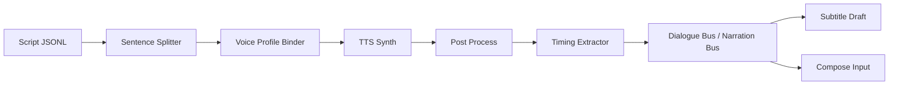

# 14_TTS与音频流水线详细设计

## 1. 子系统目标

TTS 子系统负责把结构化脚本转换为：
- 多角色对白
- 旁白
- 句级 timing
- 音频混合前素材
- 可用于字幕和口型同步的时间信息

核心目标：
- 声音一致
- 情绪可控
- 句子级重跑
- 发音问题可定位
- 与视频镜头时长协同

---

## 2. 处理链路



---

## 3. 输入模型

### 3.1 TTSSegment
```json
{
  "segment_id": "seg_001",
  "shot_id": "SC01_SH01",
  "speaker": "旁白",
  "text": "夜里，边城下起了雨。",
  "emotion_tags": ["calm", "dark"],
  "speed": 1.0,
  "pause_before_ms": 200,
  "pause_after_ms": 300
}
```

### 3.2 VoiceProfile
```json
{
  "voice_profile_id": "vp_narrator_v1",
  "engine": "fish_speech",
  "reference_audio": "voices/narrator.wav",
  "style_tags": ["calm", "professional"],
  "language": "zh",
  "fallback_engine": "cosyvoice"
}
```

---

## 4. 音频处理阶段

### 4.1 Sentence Splitter
职责：
- 按句号、引号、破折号、台词切分文本
- 控制单句长度
- 给每句加上 pause 信息

规则建议：
- 单句最长 25 个汉字左右，过长则切分
- 同一 shot 中最多 2–3 句台词
- 强情绪句允许更短切分

### 4.2 Voice Binder
职责：
- 将 speaker 映射到 voice profile
- 没有 profile 时给出 fallback
- 根据情绪标签覆盖默认 style tags

### 4.3 Synthesizer
职责：
- 调用 Fish Speech / CosyVoice
- 保存 raw wav
- 返回采样率、时长、峰值等信息

### 4.4 Post Process
职责：
- 去首尾静音
- 归一化响度
- 降噪（可选）
- 统一采样率
- 生成波形缩略图

### 4.5 Timing Extractor
职责：
- 保存句级时长
- 产出 subtitle draft
- 为镜头匹配提供时长依据

---

## 5. 关键数据流

### 5.1 句级产物
- `raw.wav`
- `normalized.wav`
- `segment.json`
- `timing.json`

### 5.2 角色总线
- `narration_bus.wav`
- `dialogue_bus.wav`
- `sfx_placeholder_track.wav`

---

## 6. 质量控制点

### 6.1 发音与文本一致性
用 ASR 回听：
- 是否漏字
- 是否数字读错
- 是否角色名读错
- 是否节奏异常

### 6.2 声音一致性
检查：
- 同角色音色差异是否过大
- 同一集内是否误用了其他角色 profile

### 6.3 时长合理性
若某句音频明显超过 shot 目标时长：
- 先降低停顿
- 再轻微加速
- 仍不合适则回到脚本层拆句

---

## 7. 重跑粒度

支持四级重跑：

1. **segment 级**
   - 只重跑某一句
2. **speaker 级**
   - 角色 profile 更新后重跑该角色所有句子
3. **shot 级**
   - 某个镜头对白整体重跑
4. **episode 级**
   - 整章语音重做

---

## 8. 版本策略

每个 segment 都有自己的 artifact：
- `tts_raw_audio`
- `tts_normalized_audio`
- `tts_asr_report`

如果用户手工替换了一句音频，也作为一个新 artifact version 写入，不覆盖旧版。

---

## 9. 接口设计

### 请求
`POST /internal/tts/tasks`

```json
{
  "task_type": "synthesize_segment",
  "segment": {...},
  "voice_profile": {...},
  "audio_config": {
    "sample_rate": 44100,
    "loudness_target_lufs": -16
  }
}
```

### 返回
```json
{
  "task_id": "tts_001",
  "status": "accepted"
}
```

### 完成结果
```json
{
  "task_id": "tts_001",
  "status": "succeeded",
  "artifact_refs": [
    {"type": "tts_raw_audio", "path": "..."},
    {"type": "tts_normalized_audio", "path": "..."},
    {"type": "timing_json", "path": "..."}
  ]
}
```

---

## 10. 混音前约束

- 所有素材统一采样率
- 所有对白规范化到统一响度
- 保留原始 wav，不可覆盖
- 在混音前不加不可逆效果
- 给旁白和对白保留独立 bus

---

## 11. 实现建议

### v1
- 只做旁白与对白
- 不做复杂环境音生成
- 不做自动 BGM 创作
- 先保证文本到语音闭环稳定

### v2
- 增加音效占位轨
- 增加角色表演风格标签
- 增加不同叙述人格

---

## 12. 异常与补偿

- Voice profile 缺失：退回人工绑定
- TTS 失败：自动切 fallback engine
- ASR 不一致：标记 QC failed，允许重跑
- 时长超限：通知编排器触发 `resplit_segment`

---

## 13. 评审 checklist

- 是否支持句子级重跑
- 是否有 voice binder
- 是否有 timing 输出
- 是否有 ASR 回听 QC
- 是否保留 raw/normalized 双版本
