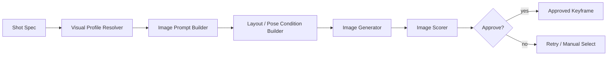

# 15_关键帧生成子系统详细设计

## 1. 子系统目标

关键帧子系统的目标不是“生成漂亮图片”这么简单，而是为视频阶段提供：

- 稳定的角色形象
- 明确的场景构图
- 可控的镜头景别
- 可复用的视觉资产
- 可替换、可审批、可局部重跑的 shot image

本子系统是“角色一致性”的第一道防线。

---

## 2. 生产链路



---

## 3. 三类图像资产

### 3.1 角色基础设定图
用途：
- 统一角色外观
- 生成 reference set
- 后续作为 IP-Adapter 输入

### 3.2 场景设定图
用途：
- 统一环境风格
- 复用背景元素
- 提高镜头一致性

### 3.3 镜头关键帧
用途：
- 直接驱动 I2V
- 提供镜头的起始画面

---

## 4. 输入结构

### 4.1 ShotSpec
```json
{
  "shot_id": "SC01_SH03",
  "shot_type": "close_up",
  "visual_intent": "女剑客低头看向袖口上的血迹",
  "camera": {
    "distance": "close-up",
    "angle": "slightly low",
    "lens": "50mm cinematic"
  },
  "characters": ["char_swordswoman"],
  "location": "tavern interior",
  "mood": ["dark", "tense"],
  "duration_hint_sec": 3.5
}
```

### 4.2 VisualProfile
```json
{
  "visual_profile_id": "vp_swordswoman_v2",
  "base_prompt": "short black hair, scar under left eye, pale skin, old thin sword",
  "negative_prompt": "extra fingers, duplicate face, blurry eyes",
  "reference_images": [...],
  "style_tags": ["realistic", "cinematic", "dark fantasy"]
}
```

---

## 5. Prompt 组装

### 5.1 Prompt Builder 输入
- shot visual intent
- 角色视觉锚点
- 场景视觉锚点
- 摄影语言
- 风格模板
- 避免项

### 5.2 Prompt Builder 输出
- 正向 prompt
- 负向 prompt
- 角色参考图集合
- control 条件集合
- seed policy

### 5.3 Prompt 模块化示例
- subject block
- costume block
- environment block
- camera block
- lighting block
- style block
- negative block

---

## 6. 一致性机制

### 6.1 Reference-first
任何出场频率高的角色，都优先使用参考图驱动，而不是纯文本抽样。

### 6.2 Seed policy
- 同一角色同一场景可复用 seed 区间
- 不同章节适当改变 seed，避免完全僵硬

### 6.3 角色视觉锚点
视觉锚点不能只是文学描述，而要是模型友好的 token 集合。

例如：
- 发色
- 发型
- 脸部特征
- 服饰主色
- 典型道具
- 年龄质感

---

## 7. 评分与审批

### 7.1 自动评分
最少应有：
- 分辨率与清晰度检查
- 人脸可见性检查
- 是否出现多余肢体
- 角色参考相似度
- 构图匹配度

### 7.2 人工审批点
建议 v1 保留人工审批：
- 角色基础设定图
- 第一批核心镜头关键帧

原因：一旦关键帧角色漂移，下游视频会一起漂。

---

## 8. 多候选策略

推荐每个关键镜头至少生成 2–4 个候选：
- `candidate_01.png`
- `candidate_02.png`
- `candidate_03.png`
- `candidate_04.png`

然后：
- 自动评分排序
- 用户可手工选择
- 被选择版本设为 approved

---

## 9. 重跑策略

### 9.1 只重跑 prompt
适合构图还行、语义不够准的情况。

### 9.2 只换参考图
适合角色脸漂了的情况。

### 9.3 只换 control 条件
适合姿态不对或景别不对。

### 9.4 完全重跑
适合严重失真。

---

## 10. 接口设计

### 请求
`POST /internal/image/tasks`

```json
{
  "task_type": "generate_keyframe",
  "shot_spec": {...},
  "visual_profiles": [...],
  "prompt_bundle": {...},
  "candidate_count": 4
}
```

### 完成结果
```json
{
  "task_id": "img_001",
  "status": "succeeded",
  "candidates": [
    {"artifact_id": "a1", "score": 0.91},
    {"artifact_id": "a2", "score": 0.84}
  ]
}
```

---

## 11. 手工替换机制

UI 必须支持：
- 上传手工图替换关键帧
- 从候选中切换 current version
- 标记为 `manual_approved`

编排器接收到替换事件后，自动将下游 `shot_video` 标记为 superseded。

---

## 12. 实现建议

### v1
- 角色基础图
- 场景基础图
- 镜头关键帧
- 候选选择

### v2
- 角色 LoRA
- 自动背景复用
- 镜头间风格稳定器

---

## 13. 评审 checklist

- 是否明确区分三类图像资产
- 是否有 reference-first 策略
- 是否支持多候选审批
- 是否支持手工替换与版本切换
- 是否有自动评分
