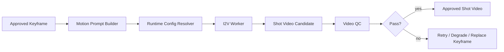

# 16_I2V视频生成子系统详细设计

## 1. 子系统目标

I2V 子系统负责把关键帧图像转换为短视频镜头。它的职责是：

- 接受关键帧和运动意图
- 输出短时长镜头视频
- 控制镜头长度、运动幅度和视觉稳定性
- 支持镜头级重跑
- 支持从多候选关键帧重新驱动生成

在 24GB 单卡环境下，本子系统必须优先保证：
- 480p 起步
- 3–5 秒镜头优先
- 逐镜头生成
- 失败可快速降级

---

## 2. I2V 不做什么

I2V 子系统不负责：
- 自动生成整章长视频
- 口型同步
- 复杂后期特效
- 剧本逻辑修复

这些应由上游或下游系统负责。

---

## 3. 输入结构

### 3.1 ShotVideoRequest
```json
{
  "shot_id": "SC01_SH03",
  "keyframe_artifact_id": "kf_001",
  "motion_prompt": "slow push-in, subtle head raise, candle flicker",
  "camera_prompt": "cinematic close-up, handheld micro movement",
  "duration_sec": 4.0,
  "resolution": "480p",
  "fps": 24,
  "seed": 12345
}
```

### 3.2 约束字段
- `max_motion_strength`
- `character_preservation_priority`
- `allow_loop_extension`
- `video_style_profile`

---

## 4. 内部流程



---

## 5. 配置档位

### 5.1 v1 推荐档
- 分辨率：480p
- 帧数：约 121 帧
- 帧率：24fps
- 时长：3–5 秒
- 候选数：1–2 个

### 5.2 强化档
- 分辨率：720p
- 仅对关键镜头开放
- 默认不自动批量使用

### 5.3 降级档
- 分辨率：更低或减少步数
- 用于 OOM 或长队列时

---

## 6. Motion Prompt Builder

不要直接复用 LLM 生成的文学句子。应将 motion prompt 压缩成：
- 主运动
- 摄影机运动
- 次要环境运动
- 情绪标签

示例：
- 主运动：人物缓慢抬头
- 摄影机运动：缓慢推进
- 环境运动：烛火闪烁
- 情绪：克制、紧绷

最终转成适合视频模型的 prompt。

---

## 7. 视频 QC

### 7.1 质量检查
- 是否成功解码
- 分辨率是否正确
- 视频是否太短或太长
- 是否出现明显闪烁
- 人脸/主体是否严重形变

### 7.2 语义检查
- 主体是否仍为目标角色
- 动作是否符合描述
- 镜头景别是否大致正确

### 7.3 音频匹配检查
- 目标时长与对白时长是否偏差过大

---

## 8. 失败与补偿

### 8.1 OOM
策略：
1. 降低分辨率
2. 降低步数
3. 清理 GPU 后重试一次
4. 标记 terminal failure

### 8.2 漂移过大
- 降低 motion strength
- 换更稳的关键帧
- 缩短镜头时长

### 8.3 时长不匹配
- 轻微速度调整
- 冻结尾帧
- 返回上游拆镜头

---

## 9. 重跑矩阵

| 触发原因 | 最小重跑范围 |
|---|---|
| motion prompt 问题 | 只重跑 shot_video |
| 关键帧角色漂移 | 关键帧 + shot_video |
| 台词时长变化 | shot_video 或 compose |
| 章节重写 | 整个 scene / episode |

---

## 10. 输出产物

- `shot_video.mp4`
- `shot_video_preview.gif`（可选）
- `video_qc_report.json`
- `runtime_metrics.json`

---

## 11. 接口设计

### 请求
`POST /internal/i2v/tasks`

```json
{
  "task_type": "generate_shot_video",
  "request": {...},
  "input_artifacts": {
    "keyframe": "artifact://...",
    "motion_prompt": "artifact://..."
  }
}
```

### 完成结果
```json
{
  "task_id": "i2v_001",
  "status": "succeeded",
  "artifact_refs": [
    {"type": "shot_video", "path": "..."},
    {"type": "video_qc_report", "path": "..."}
  ],
  "metrics": {
    "latency_sec": 83.2,
    "peak_vram_mb": 19800
  }
}
```

---

## 12. 实现建议

### v1
- 只支持单关键帧起始
- 只支持短镜头
- 只做镜头级生成
- 不做复杂镜头拼接生成

### v2
- 支持首尾帧驱动
- 支持镜头延展
- 支持更复杂的转场生成

---

## 13. 评审 checklist

- 是否默认以短镜头为最小生产单元
- 是否有 motion prompt builder
- 是否有视频 QC
- 是否有分辨率降级与 OOM 补偿
- 是否支持重新绑定关键帧再生成
