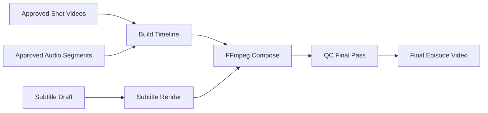

# 17_合成_字幕_QC子系统详细设计

## 1. 子系统职责

该子系统负责把多个离散产物整合为：
- 章节级时间线
- 音视频同步结果
- 字幕文件
- 最终导出视频
- 质量检查报告

它是“生产线末端”，但不能只是被动拼接，而要承担校验职责。

---

## 2. 输入产物

- shot_video 列表
- narration/dialogue 音频片段
- 时间信息
- 字幕草稿
- 项目导出配置
- 可选 BGM / SFX 轨道

---

## 3. 时间线构建

### 3.1 时间线原则
- 先以音频时长为主
- 视频围绕音频调整
- 不允许大幅拉伸视频
- 允许轻微 freeze frame / speed change

### 3.2 TimelineItem
```json
{
  "shot_id": "SC01_SH03",
  "video_path": "...",
  "audio_segments": ["seg_101", "seg_102"],
  "start_sec": 12.5,
  "end_sec": 16.8,
  "subtitle_refs": ["sub_101", "sub_102"]
}
```

---

## 4. 字幕生成

### 4.1 字幕来源
优先从 TTS segment 文本生成，而不是从视频后识别。
原因：
- 更稳定
- 不会受 ASR 误差影响
- 能保持和原脚本一致

### 4.2 字幕格式
v1 建议支持：
- SRT
- ASS

### 4.3 字幕规则
- 同一句台词尽量不跨镜头
- 过长句子提前在 TTS 阶段切分
- 保留 speaker 信息供样式分配

---

## 5. QC 设计

### 5.1 音频 QC
- 音量是否异常
- 是否存在静音段过长
- 是否存在爆音
- 是否存在句子缺失

### 5.2 视频 QC
- 是否存在空白帧
- 是否存在黑帧
- 是否存在解码失败
- 是否存在严重时长偏差

### 5.3 语义 QC
- TTS 文本和字幕文本是否一致
- 字幕时序是否覆盖音频
- 镜头与台词时长是否严重失配

### 5.4 集级 QC
- 全片总时长是否合理
- 章节节奏是否过于碎片化
- 镜头切换是否过密

---

## 6. 合成流程



---

## 7. 补偿策略

### 7.1 视频略短
- 冻结尾帧 0.2–0.8 秒
- 缓慢减速少量
- 插入环境空镜（若存在）

### 7.2 视频略长
- 剪掉尾部无效部分
- 轻微加速

### 7.3 音频略短
- 保留环境音或留白
- 不强行延长对白

### 7.4 严重失配
- 回退到 shot 级重跑

---

## 8. 输出产物

- `episode_timeline.json`
- `episode_subtitle.srt`
- `episode_subtitle.ass`
- `episode_preview.mp4`
- `episode_final.mp4`
- `final_qc_report.json`

---

## 9. 接口设计

### 请求
`POST /internal/compose/tasks`

```json
{
  "task_type": "compose_episode",
  "episode_id": "ep01",
  "timeline_items": [...],
  "audio_bus_refs": {...},
  "subtitle_config": {...},
  "render_config": {
    "resolution": "1280x720",
    "burn_subtitle": true
  }
}
```

### 结果
```json
{
  "task_id": "compose_001",
  "status": "succeeded",
  "artifact_refs": [
    {"type": "episode_final_video", "path": "..."},
    {"type": "final_qc_report", "path": "..."}
  ]
}
```

---

## 10. 关键实现细节

- 使用 FFmpeg filtergraph 统一处理拼接、音频混合和字幕烧录
- timeline 构建逻辑独立于 FFmpeg 命令生成
- 合成前先生成“预览版”方便快速检查
- 正式导出与预览导出使用不同 profile

---

## 11. 手工介入点

UI 应允许：
- 手动拖动某个镜头在时间线的位置
- 关闭某条字幕
- 替换某个 shot 使用的版本
- 选择是否烧录字幕

---

## 12. 评审 checklist

- 是否先构建 timeline 再渲染
- 字幕是否来源于 TTS 文本
- 是否有 final QC
- 是否支持 freeze frame / trim 等轻度补偿
- 是否有预览导出机制
