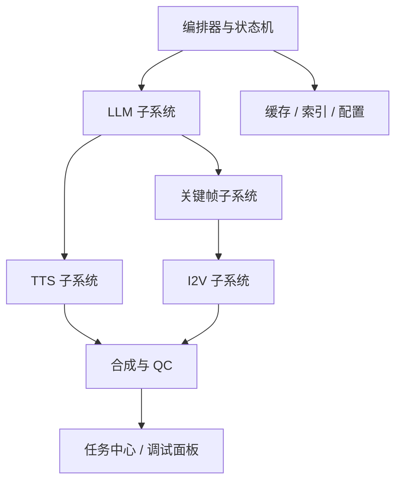

# 本地小说到视频系统详细设计文档包

版本：v3.0  
日期：2026-03-29  
目标环境：单机、本地、单张 24GB VRAM GPU  
文档层级：详细设计 / 模块级设计 / 编码前评审

---

## 文档定位

这一包文档承接上一版工程设计文档，继续向下细化到“可以进入实现”的粒度。重点不是再讲一遍总体架构，而是明确：

- 每个子系统到底负责什么
- 模块之间如何交互
- 输入输出数据长什么样
- 状态如何流转
- 失败后怎么回滚或重跑
- 在 24GB 单卡约束下如何调度 GPU
- 前后端和编排器如何对接
- 如何做测试、日志、缓存、版本与调试

---

## 推荐阅读顺序

### 先整体把握实现方式
1. [10_分层架构与模块职责详细设计.md](10_分层架构与模块职责详细设计.md)
2. [11_领域模型与实体生命周期.md](11_领域模型与实体生命周期.md)
3. [12_编排引擎与任务队列详细设计.md](12_编排引擎与任务队列详细设计.md)

### 再逐个实现核心生产链
4. [13_LLM子系统详细设计.md](13_LLM子系统详细设计.md)
5. [14_TTS与音频流水线详细设计.md](14_TTS与音频流水线详细设计.md)
6. [15_关键帧生成子系统详细设计.md](15_关键帧生成子系统详细设计.md)
7. [16_I2V视频生成子系统详细设计.md](16_I2V视频生成子系统详细设计.md)
8. [17_合成_字幕_QC子系统详细设计.md](17_合成_字幕_QC子系统详细设计.md)

### 然后补齐工程化能力
9. [18_工作流DSL与模板系统设计.md](18_工作流DSL与模板系统设计.md)
10. [19_配置管理_插件机制_与模型适配层.md](19_配置管理_插件机制_与模型适配层.md)
11. [20_存储_索引_缓存_与版本管理.md](20_存储_索引_缓存_与版本管理.md)
12. [21_可观测性_日志_指标_与调试面板设计.md](21_可观测性_日志_指标_与调试面板设计.md)
13. [22_测试矩阵_故障注入_与性能基线.md](22_测试矩阵_故障注入_与性能基线.md)
14. [23_前后端交互与任务中心设计.md](23_前后端交互与任务中心设计.md)
15. [24_开发里程碑_仓库结构_与编码规范.md](24_开发里程碑_仓库结构_与编码规范.md)

---

## 这套文档的使用方式

建议按“三层交付”推进：

### 第 1 层：先做能跑通的最小闭环
- 构思输入
- 小说与分镜生成
- 旁白与对白生成
- 关键帧生成
- I2V 镜头生成
- 视频合成
- 局部重跑

### 第 2 层：再做工程能力
- 编排器状态持久化
- Artifact 索引与缓存
- 统一配置中心
- 任务中心 UI
- 观测和调试

### 第 3 层：最后做高级能力
- 自定义 workflow 模板
- 角色 LoRA / Voice Profile
- 批量章节生成
- 自动风格迁移
- 质量评分与自动重试策略

---

## 建议实现顺序

---

## 文档清单

- 10 分层架构与模块职责详细设计
- 11 领域模型与实体生命周期
- 12 编排引擎与任务队列详细设计
- 13 LLM 子系统详细设计
- 14 TTS 与音频流水线详细设计
- 15 关键帧生成子系统详细设计
- 16 I2V 视频生成子系统详细设计
- 17 合成、字幕、QC 子系统详细设计
- 18 工作流 DSL 与模板系统设计
- 19 配置管理、插件机制与模型适配层
- 20 存储、索引、缓存与版本管理
- 21 可观测性、日志、指标与调试面板设计
- 22 测试矩阵、故障注入与性能基线
- 23 前后端交互与任务中心设计
- 24 开发里程碑、仓库结构与编码规范

---

## 交付原则

本包文档坚持以下原则：

1. **能在 24GB 单卡下落地**
2. **先可运行，再可扩展**
3. **每个阶段都支持局部重跑**
4. **所有产物可追溯、可缓存、可比较**
5. **模块接口优先用稳定 JSON 契约**
6. **GPU 重任务串行，CPU 任务并行**
7. **尽量避免把“创作意图”直接耦合到模型提示词里，必须通过中间结构表达**
